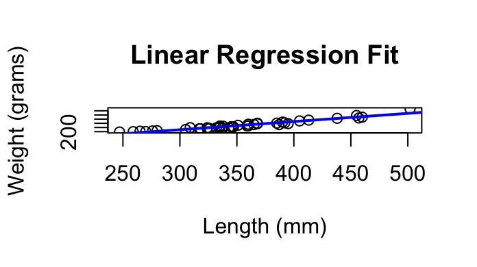
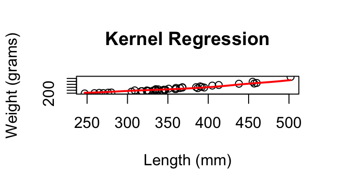
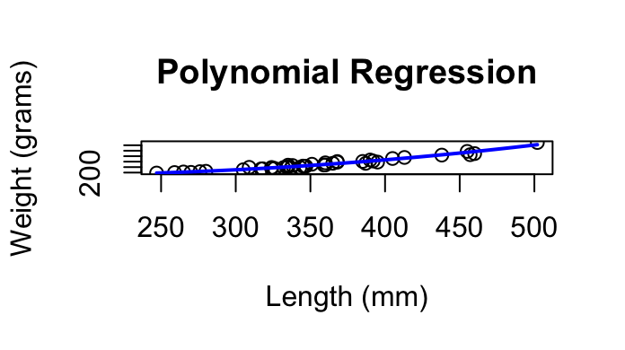

# Regression Model Comparison
## Overview

This project compares multiple regression approaches for predicting trout weight from length and evaluates their predictive performance using cross-validation.

## Models Compared
Linear Regression
Kernel Regression
Polynomial Regression (degree 2)

## Evaluation

Model performance was assessed with:

Leave-One-Out Cross-Validation (LOOCV)
5-Fold Cross-Validation

## Visualizations

### Linear Regression

### Kernel Regression

### Polynomial Regression

## Results

The polynomial regression model achieved the lowest prediction error and provided the best balance between flexibility and generalization.

Linear regression underfit the curvature in the data
Kernel regression fit the pattern more flexibly, but produced higher prediction error
Polynomial regression captured the nonlinearity while maintaining lower cross-validation error

## Key Insight

A model that looks better visually does not always predict better. Cross-validation showed that polynomial regression outperformed both the simpler linear model and the more flexible kernel regression.

## Tech Stack

R
Linear regression with lm()
Custom LOOCV and 5-fold cross-validation
Gaussian kernel regression

## Note

This project is adapted from coursework and refined for portfolio presentation.
